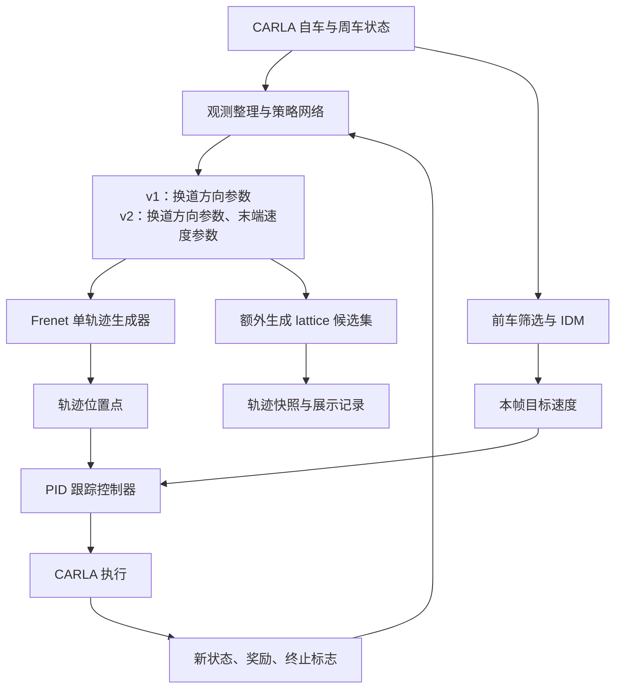

# 从代码理解本项目：Frenet、Lattice、强化学习与 v1/v2 的边界

> 本文用于项目介绍和学习回顾，重点回答：网络到底学什么、轨迹如何生成、是否对候选轨迹评分、IDM 如何参与控制，以及当前实现与论文表述有哪些差异。
>
> 核查日期：2026-09-25。代码基准：当前工作区，HEAD 为 `c17acb569a3bc5c66c453441dec6cc64c3f1b13f`。本文是静态代码阅读结论，没有运行 CARLA 重新验证驾驶性能。后续修改代码时应同步更新本文。
>
> 本文位于 `outputs/readme2.md`，源码链接按此目录使用相对路径，适合随仓库上传 GitHub。

## 1. 先明确当前实现的整体结构

当前 v1、v2 的执行主链路可以概括为：

**仿真状态 → 强化学习动作 → 单条 Frenet 轨迹 → IDM 速度命令与 PID 跟踪 → 行驶结果 → 强化学习奖励。**



规划器文件中确实实现了 lattice 候选生成、可行性检查和手工代价选择。但当前两个环境的 `step()` 调用的是 `run_step_single_path()`：先确定执行轨迹，再生成候选集并写入快照。不能把展示中的候选轨迹理解为“网络已经逐条评分，并从中挑出执行轨迹”。

代码入口：[v1 环境](../carla_gym/envs/carla_env_v1.py)、[v2 环境](../carla_gym/envs/carla_env_v2.py)、[FrenetPlanner](../agents/local_planner/frenet_optimal_trajectory.py)。可搜索 `step`、`run_step_single_path`、`last_plan_candidates`、`_write_plan_snapshot`。

## 2. v1 和 v2 分别输出什么、学习什么

| 对比项 | v1 | v2 |
|---|---|---|
| 动作空间 | 一个连续数，范围为 `[-1, 1]` | 两个连续数，各在 `[-1, 1]` |
| 横向动作 | 经阈值转换为向一侧换道、保持、向另一侧换道 | 同 v1 |
| 纵向轨迹参数 | `Vf_n=-1`，映射到配置的最小规划末端速度 | 第二个动作映射成末端纵向速度 |
| 规划时长 | `PLAN_TF`，默认 5 秒 | 传入的 `Tf` 固定为 5 秒 |
| 固定观测表示 | 每个历史时刻 9 个特征 | 每个历史时刻 15 个特征，覆盖更多相邻车道位置 |
| 决策能力 | 学习何时、向哪边换道 | 学习换道决策，并调整纵向轨迹参数 |
| 实际速度命令 | IDM 计算 | IDM 计算 |

启动脚本 [run.py](../run.py) 的默认环境是 `CarlaGymEnv-v1`；具体强化学习算法由配置选择，环境版本本身不等于某种算法。

### 2.1 连续数值接口不等于连续横向位置控制

`run_step_single_path()` 使用如下转换：

```python
if df_n < -0.33:
    df = -1
elif df_n > 0.33:
    df = 1
else:
    df = 0
```

随后根据车道宽度、当前横向位置及可用车道中心，确定目标 `df`。因此横向动作实际上形成三类指令，网络不能通过输出 `0.6` 和 `0.9` 自由指定两个不同的车道内偏移。

### 2.2 神经网络学到的是状态到动作的策略

例如，前车较慢、相邻车道有空隙时，网络学习是否换道能带来更高的累计奖励。网络没有直接输出每个轨迹点，也没有学习五次多项式的六个系数。

规划器将策略输出转换成满足边界条件的曲线。实际训练得到的策略是否安全、高效，需要评测，不能仅凭动作定义推断。

两个环境在每个 episode 的第一次 `step()` 还会覆盖网络动作，分别使用 `0` 和 `[0, -1]`，用于初始运动。因此并非所有记录的网络动作都在该步原样执行。

## 3. 没有专家轨迹 GT，为什么能训练

这里要区分两种“真值”：

- **状态真值**：仿真器提供的车辆位置、速度等信息。本项目使用了这类信息。
- **监督标签**：专家动作、最优轨迹或每条候选轨迹的正确分数。当前训练主链路没有依赖这类标签。

强化学习从交互中收集 `(状态, 动作, 奖励, 下一状态, 是否终止)`。环境根据实际行驶结果计算奖励，主要包括：

- 实际车速接近环境期望速度时获得速度奖励。
- 换道后速度收益不足时扣减奖励；收益达到设定条件时增加奖励。
- 碰撞时用碰撞惩罚覆盖奖励，并结束 episode。
- 试图越界时给予越界惩罚；当前代码该分支没有一律终止 episode。

这里的越界标志主要来自规划目标是否超出允许横向范围，不应直接等同于传感器检测到车辆已经驶离道路。

以 DDPG 为例，critic 学习动作的长期价值，其训练目标为：

$$
y=r+\gamma(1-\mathrm{done})Q_{\mathrm{target}}(o',\pi_{\mathrm{target}}(o'))
$$

critic 拟合该目标，actor 则调整动作以提高估计价值。这里使用 $o$ 表示网络观测，避免与 Frenet 纵向坐标 $s$ 混淆。

critic 的价值估计不能解释为“在运行时把全部 lattice 候选输入网络评分”。其他算法，例如 PPO，训练目标和更新方式不同，也不应直接套用 DDPG 的公式。

代码依据：[DDPG 实现](../agents/reinforcement_learning/stable_baselines/ddpg/ddpg.py)，搜索 `target_q`、`critic_loss`、`actor_loss`。奖励见两个环境的 `step()`。

## 4. 项目中的 lattice 到底在哪里

[FrenetPlanner](../agents/local_planner/frenet_optimal_trajectory.py) 包含两种流程：

| 流程 | 核心调用 | 做什么 |
|---|---|---|
| 候选搜索流程 | `frenet_optimal_planning()` | 生成候选、转换坐标、计算曲率、调用可行性检查、按手工代价选轨迹 |
| 单轨迹流程 | `run_step_single_path()` | 把动作映射成目标边界条件，直接生成一条轨迹 |

候选生成函数 `calc_frenet_paths()` 会改变横向目标、规划时长和末端速度。当前代码中的候选时长采样为 3 秒和 6 秒。手工代价 `cf` 由横纵向 jerk、规划时长和终点误差等项组成，系数由代码设定。

**当前 v1/v2 的执行轨迹走单轨迹流程，候选集额外生成用于记录；手工代价 `cf` 既没有决定该步的执行轨迹，也没有充当网络监督标签。**两个环境的规划器初始化同样显式使用 `optimal_path=False`。

单条多项式轨迹也可以称为一个运动基元或一个 lattice 轨迹，但这不代表实际决策进行了“枚举候选 → 学习打分 → 选最优”的搜索。

## 5. 道路参考线如何建立

### 5.1 地图点的来源

环境优先读取 [global_route_town04.npy](../road_maps/global_route_town04.npy)。代码注释将其描述为从左数第二条车道的中心路线。

文件不存在时，环境从 Town04 的固定地图位置查询道路 waypoint，依次查询前方 1、3、5……米处的点，保存 1520 个三维坐标。路线顺序和道路选择在这一步确定。

### 5.2 从离散点得到连续曲线

对于有序点 $P_i=(x_i,y_i,z_i)$，先计算相邻点的距离并累计：

$$
s_0=0,\qquad s_{i+1}=s_i+\|P_{i+1}-P_i\|
$$

随后分别构造三个自然三次样条：

$$
x_{\mathrm{ref}}(s),\qquad y_{\mathrm{ref}}(s),\qquad z_{\mathrm{ref}}(s)
$$

样条经过地图点，段与段之间的位置、一阶导数、二阶导数连续。这里的 $s$ 来自累计折线长度，是曲线弧长的近似；实现没有对插值曲线再做精确弧长重参数化。

代码依据：[cubic_spline_planner.py](../agents/local_planner/cubic_spline_planner.py)，搜索 `Spline`、`Spline3D`；规划器中搜索 `update_global_route`。

### 5.3 参考线不随换道移动

参考线通常在环境初始化时建立，作为各车道共同的坐标基准。$s$ 表示沿路线走到哪里，$d$ 表示横向偏离参考线多少。

车道中心大致对应固定的 $d$；换道对应 $d(t)$ 随时间变化。当前代码按固定车道宽度确定目标车道中心，不能直接推广为任意道路拓扑下的通用车道建模。

## 6. 局部 Frenet 轨迹如何生成

一条局部轨迹由两个时间函数组成：

$$\tau(t)=[s(t),d(t)],\qquad 0\le t\le T$$

- 横向 $d(t)$ 使用五次多项式，连接当前横向状态与目标横向状态。
- 纵向 $s(t)$ 使用四次多项式，连接当前纵向状态与末端速度、加速度约束。

最后，在离散时刻计算 $(s(t),d(t))$，利用参考线转换成世界坐标。若参考线的方向为

$$\theta(s)=\operatorname{atan2}(y'_{\mathrm{ref}}(s),x'_{\mathrm{ref}}(s))$$

则代码采用：

$$
x=x_{\mathrm{ref}}(s)-d\sin\theta(s),\qquad
y=y_{\mathrm{ref}}(s)+d\cos\theta(s),\qquad
z=z_{\mathrm{ref}}(s)
$$

这里是参考线方向下的水平横向偏移，不能把它理解为完整的三维道路曲面模型。

**全局参考线的三次样条和局部轨迹的四/五次多项式用途不同。**局部规划连接的是“当前状态与未来边界条件”，无需预先给出一条未来轨迹。

## 7. 五次多项式的边界条件与系数求解

横向曲线为：

$$d(t)=a_0+a_1t+a_2t^2+a_3t^3+a_4t^4+a_5t^5$$

六个边界条件如下：

| 时刻 | 横向位置 | 横向速度 | 横向加速度 |
|---|---|---|---|
| 起点 $t=0$ | $d_0$ | $v_{d0}$ | $a_{d0}$ |
| 终点 $t=T$ | $d_f$ | $v_{df}=0$ | $a_{df}=0$ |

规划时长 $T$ 是额外给定的参数，并非第七个约束方程。

代入起点条件，直接得到：

$$a_0=d_0,\qquad a_1=v_{d0},\qquad a_2=a_{d0}/2$$

剩下三个系数由以下线性方程组确定：

$$
\begin{bmatrix}
T^3&T^4&T^5\\
3T^2&4T^3&5T^4\\
6T&12T^2&20T^3
\end{bmatrix}
\begin{bmatrix}a_3\\a_4\\a_5\end{bmatrix}
=
\begin{bmatrix}
d_f-a_0-a_1T-a_2T^2\\
v_{df}-a_1-2a_2T\\
a_{df}-2a_2
\end{bmatrix}
$$

`quintic_polynomial` 使用 `np.linalg.solve(A, b)` 求解，不需要神经网络训练。

例如，从 $d_0=0$ 出发，起点横向速度和加速度均为零，在 5 秒后到达 $d_f=3.5$ 米，得到：

$$d(t)=0.28t^3-0.084t^4+0.00672t^5$$

| 规划时间 | 横向偏移 |
|---|---:|
| 0 秒 | 0 米 |
| 1 秒 | 约 0.20 米 |
| 2 秒 | 约 1.11 米 |
| 2.5 秒 | 1.75 米 |
| 3 秒 | 约 2.39 米 |
| 4 秒 | 约 3.30 米 |
| 5 秒 | 3.50 米 |

这些是规划曲线的数值，不是承诺车辆实际在相同时刻达到的位置。

**固定的是多项式形式，系数由边界条件重新求解。**若起点状态、目标车道宽度和时长基本相同，横向时间曲线也会基本相同；但道路曲率、纵向运动和初始状态变化仍会改变空间轨迹及曲率。

实现细节：`estimate_frenet_state()` 会更新位置和速度估计，但加速度更新代码被注释，因此传入的初始加速度沿用了上一规划状态中的值，不能一概称为实时测得的真实加速度。

## 8. v2 第二个动作如何改变轨迹，却不直接控制车速

第二个动作 $a_v\in[-1,1]$ 被映射为：

$$V_f=\frac{V_{\min}+V_{\max}}2+a_v\frac{V_{\max}-V_{\min}}2$$

其中上下限来自 `LOCAL_PLANNER.MIN_SPEED/MAX_SPEED`。纵向四次多项式使用五个约束：当前 $s_0,\dot s_0,\ddot s_0$，以及 $\dot s(T)=V_f,\ddot s(T)=0$。终点位置 $s(T)$ 是求解结果。

相同横向曲线下，增大末端速度通常会增加规划前进距离，使换道分布在更长的道路距离上；保持车道时则主要改变轨迹覆盖范围与点间距。

但环境跟踪代码采用：

```python
cmdWP = [fpath.x[self.f_idx], fpath.y[self.f_idx]]
cmdWP2 = [fpath.x[self.f_idx + 1], fpath.y[self.f_idx + 1]]
cmdSpeed = self.IDM.run_step(vd=self.targetSpeed, vehicle_ahead=vehicle_ahead)
control = self.vehicleController.run_step_2_wp(cmdSpeed, cmdWP, cmdWP2)
```

控制器没有直接使用 `fpath.s_d[self.f_idx]` 作为目标速度；路径点也按车辆空间位置选取，并非按规划时间强制对齐。因此，$V_f$ 会影响路径几何与执行过程，却不能保证实际车辆在 5 秒后达到该速度。第二动作对奖励的影响是通过整个闭环间接产生的，不能据此认定它已经实现独立、完整的纵向速度控制。

## 9. IDM、PID 和 MOBIL 的分工

### IDM：根据跟车情况给出速度命令

[IntelligentDriverModel](../agents/low_level_controller/controller.py) 根据自车速度、前车速度、距离及期望速度计算加速度，再用：

$$v_{\mathrm{cmd}}=v_{\mathrm{current}}+a_{\mathrm{IDM}}\Delta t$$

得到本帧目标速度。PID 根据目标速度和轨迹位置点产生油门、制动、转向。

IDM 是独立的跟车模块，没有参与本项目 Frenet 多项式系数的求解。背景车辆控制代码也使用 IDM。

### MOBIL：不能根据论文或算法名称推定仓库已实现

MOBIL 是规则式换道模型，通常根据换道收益及对目标车道后车的制动影响等条件判断是否换道。可参考 [MOBIL 作者说明](https://mtreiber.de/MicroApplet/MOBIL.html)。

当前仓库中没有找到 MOBIL 的实现或调用。当前自车换道由强化学习动作决定，不能将现有运行链路称为“IDM + MOBIL”，也没有证据说明 MOBIL 在对策略动作进行安全审核。

## 10. 规划时长、控制周期和 RL step 是三件事

| 概念 | 当前代码中的含义 |
|---|---|
| 规划时长 $T$ | 多项式覆盖的未来时间范围；v2 为 5 秒 |
| CARLA 仿真步长 | 常用配置 `DT=0.1` 秒，每次推进一帧的仿真时间 |
| 一次环境 `step()` | 一次网络决策后，内部执行多帧跟踪，最后返回状态和奖励 |
| 候选集生成频率 | 每次进入 `step()` 的规划阶段生成一次 |

v2 跟踪循环的逻辑是：

```python
while f_idx < wps_to_go and (
    elapsed_wall_time < 4.5
    or loop_counter < LOOP_BREAK
    or lanechange
):
    # 跟踪并推进一帧；发生碰撞时提前退出
```

其中 4.5 来自 `motionPlanner.D_T * 1.5`，`D_T=3`；`LOOP_BREAK` 在现有常用配置中为 30。这里使用 **现实运行时间** `time.time()`，并且条件之间是 `or`：未换道时，只有耗时达到阈值且循环次数达到阈值，这部分条件才失效。接近轨迹末尾或碰撞可以更早结束；换道标志为真时，时间和次数条件不会单独终止跟踪。

因此，不能写成“每 0.1 秒重规划”或“每 5 秒重规划”。一次 step 的仿真时长约等于内部实际帧数乘以 `DT`，需要运行记录才能得到具体分布。5 秒规划时域也不是跟踪循环的严格执行上限。

另外，`np.arange(0, T, dt)` 不包含 $T$ 本身；例如 $T=5,dt=0.1$ 时采样到 4.9 秒，末端边界条件仍在数学曲线的 5 秒处成立。

## 11. 周车信息是不是“全知”

当前自车决策链路直接读取仿真车辆状态：

1. 环境遍历 `traffic_module.actors_batch`，读取周车 Frenet 状态。
2. 按相对位置整理观测，并筛选相关前车。
3. IDM 直接读取车辆对象的 `get_location()` 和速度，计算距离与相对速度。

它没有经过摄像头/雷达检测、目标跟踪和测距估计。仓库存在摄像头代码，但这些状态输入不依赖视觉检测结果。

准确表述是：**环境能访问所管理周车的仿真状态，网络接收的是筛选、压缩后的部分状态信息。**网络没有获得所有未来行为，Frenet 状态转换也可能有近似误差；这不等于完整、无误差的全知预测。

当前链路没有显式模拟感知遮挡、漏检和测距噪声。IDM 使用的距离是车辆坐标点间的欧氏距离，没有扣除车身长度，不能直接等同于保险杠间的净间距。

## 12. 平滑轨迹是否意味着安全

六个横向边界条件只保证起终点状态，不能保证中途不碰撞，也没有直接保证最大横向加速度、曲率、jerk 等全过程约束。

当前单轨迹执行流程没有调用 `check_paths()` 对执行轨迹进行可行性筛选。IDM 能处理部分纵向跟车情况，但不是覆盖侧向、后车及多车交互的完整碰撞保护。

实际碰撞发生后，环境读取碰撞记录，退出跟踪循环，给予惩罚并结束 episode。这是事后训练反馈，不能描述为碰撞前的安全保证。

即使今后接入现有 `check_paths()`，也需核查其障碍物数据和碰撞检查实现，不能仅凭函数名称认为已经具备动态障碍物预测、车辆外形碰撞检测或安全保证。

## 13. 与论文表述如何对照

原 README 引用的论文为 [An End-to-end Deep Reinforcement Learning Approach for the Long-term Short-term Planning on the Frenet Space](https://arxiv.org/abs/2011.13098)。以下对照基于 [arXiv v1 正文](https://arxiv.org/html/2011.13098)，不代表核查了作者所有后续版本、分支或实验程序。

论文第 II 节讨论 lattice 搜索基线，第 III 节讨论离散决策 RL，第 IV 节提出连续轨迹参数方法。这些流程应分别阅读，不能合并成一套实现。

| 核对点 | 论文对应表述 | 当前工作区代码 |
|---|---|---|
| 动作空间 | 第 IV 节式 (2)：$v_f,d_f,t_f$ 三个连续参数 | v1 一维，v2 二维；均不学习规划时长 |
| 横向参数 | 第 IV 节讨论连续终端参数 | 两个环境都将横向动作阈值化，再确定车道中心 |
| 候选搜索 | 第 II 节基线生成、筛选候选轨迹 | 主执行链路直接生成单轨迹；额外候选用于记录 |
| MOBIL | 第 II 节基线包含 MOBIL | 未找到实现或调用 |
| 感知输入 | 第 III/IV 节说明实验使用 ground truth | 使用仿真状态；这一点本身不是代码偏差 |
| end-to-end 含义 | 第 IV 节明确指输出轨迹，不是直接输出执行器指令 | 保留解析规划与反馈控制；不可宣传为图像到油门转向 |

代码还显示 v2 跟踪速度由 IDM 计算。评价其纵向轨迹执行能力时，应报告这一事实，不能仅由动作名称推断完整速度轨迹被跟踪。

**当前 v1/v2 不能仅凭名称直接等同于论文的离散/连续两种方法。**尤其是 v1 使用连续动作接口再阈值化，不等同于论文第 III 节所述 DQN 实验。上述差异说明当前工作区不能直接当作论文完整方法的逐项复现；它们不构成对论文实验有效性的否定，也不能据此推断差异产生于哪个历史提交。

## 14. 介绍本项目时可以采用的表述

> 本项目在 CARLA 中实现基于 Frenet 表示的强化学习驾驶决策与轨迹执行框架。当前 v1 学习换道方向，v2 在此基础上增加规划末端速度参数。解析多项式生成器根据动作和当前状态构造单条局部轨迹，IDM 提供跟车速度命令，PID 完成车辆跟踪。训练通过仿真交互奖励完成，输入使用仿真器车辆状态。仓库保留 lattice 候选搜索实现，但当前两个环境的执行主链路没有使用神经网络对候选轨迹逐条评分。当前代码与论文三参数连续轨迹方法存在需要说明的实现差异。

回顾或扩展项目时，可优先检查：动作维度与实际映射是否一致、规划速度是否真正参与跟踪、重规划周期是否使用仿真时间、执行轨迹是否经过动态碰撞检查，以及状态输入是否包含真实感知误差。这些是后续改进方向，不是当前已实现的能力。

## 15. 源码阅读索引

| 文件 | 建议查找的函数或变量 |
|---|---|
| [run.py](../run.py) | `--env`、模型创建、`model.learn`、`model.predict` |
| [carla_env_v1.py](../carla_gym/envs/carla_env_v1.py) | `fix_representation`、`step`、`PLAN_TF`、奖励与终止分支 |
| [carla_env_v2.py](../carla_gym/envs/carla_env_v2.py) | `step`、`get_vehicle_ahead`、`_write_plan_snapshot` |
| [frenet_optimal_trajectory.py](../agents/local_planner/frenet_optimal_trajectory.py) | `quintic_polynomial`、`quartic_polynomial`、`run_step_single_path`、`frenet_optimal_planning` |
| [cubic_spline_planner.py](../agents/local_planner/cubic_spline_planner.py) | `Spline`、`Spline3D` |
| [controller.py](../agents/low_level_controller/controller.py) | `IntelligentDriverModel`、`VehiclePIDController` |
| [modules.py](../tools/modules.py) | `actors_batch`、`Frenet State`、CARLA 同步步进 |
| [DDPG 配置示例](../tools/cfgs/DDPG.yaml) | `CARLA.DT`、`GYM_ENV`、`RL`、`LOCAL_PLANNER` |
| [DDPG 训练实现](../agents/reinforcement_learning/stable_baselines/ddpg/ddpg.py) | `target_q`、`critic_loss`、`actor_loss` |
